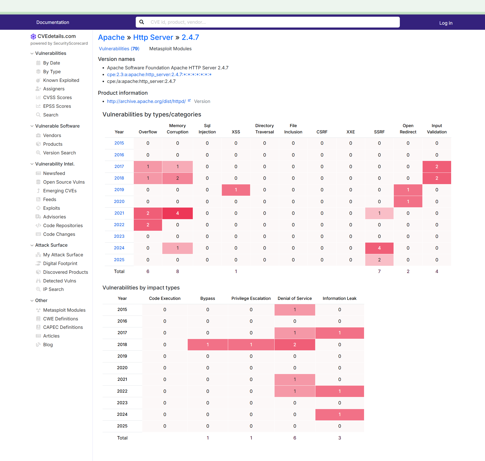
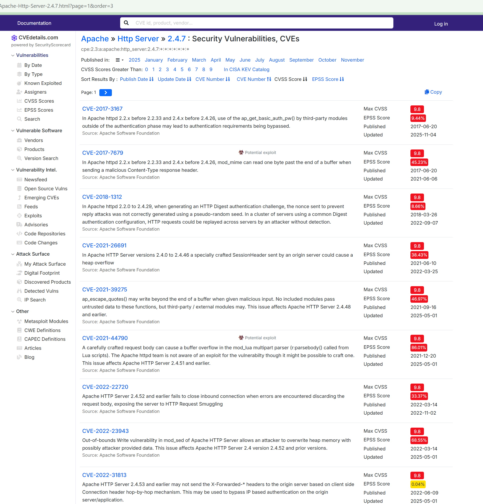
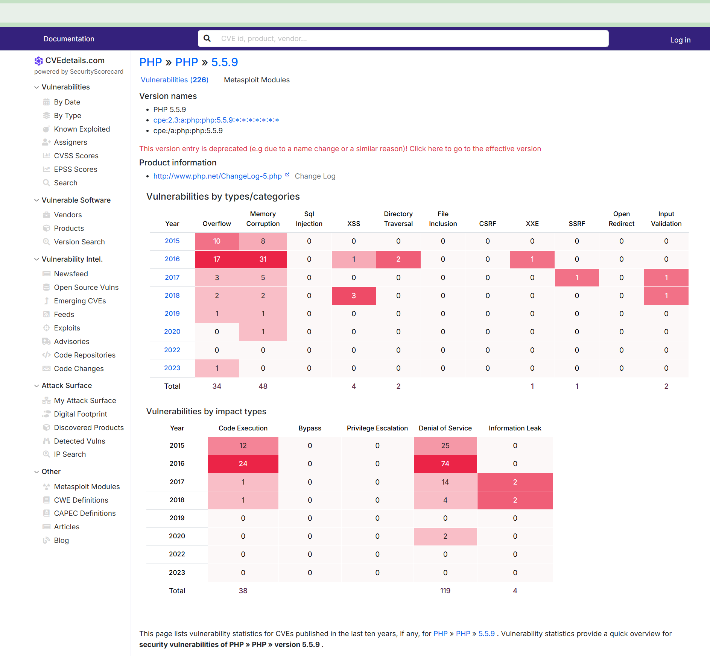
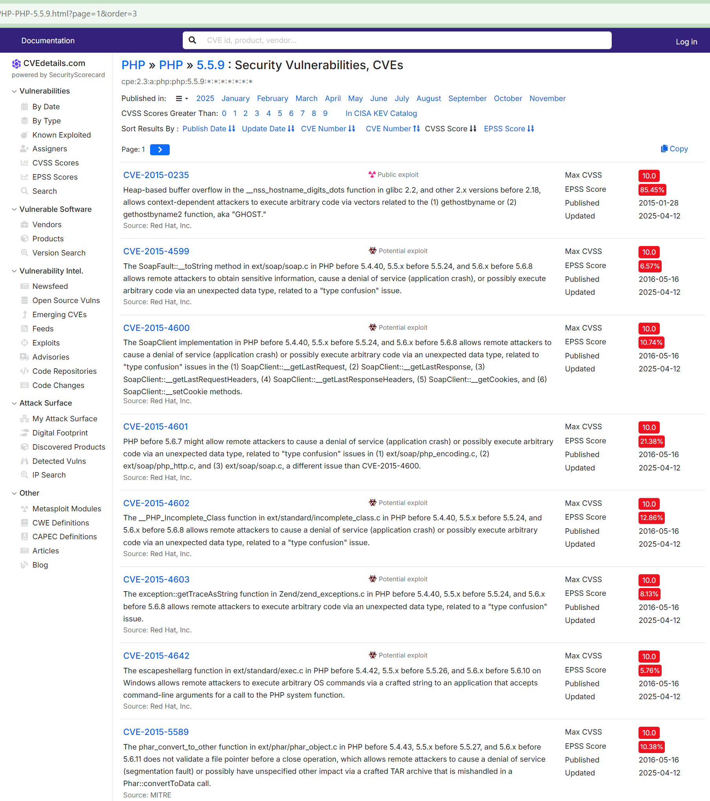

# Дипломная работа по профессии «Специалист по информационной безопасности»

## Тема диплома: Track Penetration Testing

### Студент: Зайцев Александр Юрьевич гр. SIB-46 2025г.

### Аннотация:  
 
Этот отчет содержит результаты проверки безопасности веб-сервиса 92.51.39.106. Проверка проводилась методом черного ящика по стандартным этапам: разведка, сканирование, поиск уязвимостей и составление отчета.
Были проверены два веб-приложения на портах 8050 и 7788. Обнаружены многочисленные критические уязвимости, такие как:
* SQL-инъекции и выполнение команд на сервере.
* Межсайтовый скриптинг (XSS).
* Возможность чтения системных файлов.
* Небезопасная загрузка файлов, позволившая выполнить код на сервере.
Каждая уязвимость подтверждена, оценена по степени риска и снабжена рекомендациями по исправлению. Отчет показывает серьезные пробелы в безопасности и служит основой для их устранения.

## Вводные данные:
### Задача
Нужно протестировать сервис на безопасность — провести полноценое тестирование на проникновение методом чёрного ящика. Известен только адрес тестируемого приложения — 92.51.39.106.

### Исходные данные
Требования к тестированию. Тестирование должно проходить в рамках пентеста приложения, поэтапно, без деструктивных действий в сторону сервисов и других тестеров. Рекомендуем использовать полезные материалы и open source инструменты, рассмотренные на курсе.


## Этап 1. OSINT
<details>
<summary> Критерии достижения: </summary>

* Собрано необходимое количество информации о сервисе, были использованы различные сервисы для получения инфомрации — Google, Shodan, CVE Details.
* Собранная информация систематизирована, имеет прямое отношение к тестируемому сервису, имеет ценность для тестирвоания.
* Полученная информация оценена и проанализирована.
</details>

На первом этапе использовали сервисы:
* www.shodan.io
* www.criminalip.io
* www.google.com
* www.cvedetails.com

Результаты сбора информации:

### Shodan.io:

GeneralInformation  

| Параметр | Значение |
|:-----------|:----------|
| Hostnames | 1427771-cg36175.tw1.ru |
| Domains | tw1.ru |
| Country | Russian Federation |
| City | Saint Petersburg |
| Organization | TimeWeb Ltd. |
| ISP | TimeWeb Ltd. |
| ASN | AS9123 |
| Operating System | Linux |

WebTechnologies  

| Параметр | Значение |
|:-----------|:----------|
| Operating systems | Ubuntu |
| Programming languages | PHP 5.5.9 |
| Web servers | Apache HTTP Server 2.4.7 |

OpenPorts  

| Параметр | Значение |
|:-----------|:----------|
| 22 | OpenSSH 8.2p1 Ubuntu 4ubuntu0.13 |
| 8050 | Apache/2.4.7 (Ubuntu) NetologyVulnApp.com |
| 10050 | |

Так же найдено множество уязвимостей на порту 8050

Vulnerabilities  

| Параметр | Значение |
|:-----------|:----------|
| Critical | 93 |
| High | 134 |
| Medium | 100 |
| Low | 7 |


В связи с тем, что по порту 10050 никакой информации сервис не выдал, проверил порт через nmap
```
nmap -sV -sC -p 10050 92.51.39.106
```
Получил информацию, что на порту висит zabbix-agent

[Выявленные уязвимости](./docs/shodan.md)  
[Скриншоты](./docs/shodanscreen.md)


### criminalip.io

Сервис сразу предупреждает:
* This is a malicious IP Address.
* This IP Address has critical vulnerabilities.

Connection  

| Параметр | Значение |
|:-----------|:----------|
| IP Address Owner | Jsc timeweb |
| Hostname | 1427771-cg36175.tw1.ru |
| Country | Russian Federation |

Current Open Ports  

| Параметр | Значение |
|:-----------|:----------|
| TCP 22 | OpenSSH 8.2p1 |
| TCP 8050 | Apache 2.4.7 NetologyVulnApp.com |

WHOIS  

| Параметр | Значение |
|:-----------|:----------|
| ASN | 9123 |
| AS Name | Jsc timeweb |
| Organization Name | TIMEWEB |
| Country Code | RU |
| Country | Russian Federation |
| Region | St.-Petersburg |
| City | St Petersburg |
| Postal Code | 195213 |

Security  

| Параметр | Значение |
|:-----------|:----------|
| Abuse Record | 0 |
| Open Ports | 2 |
| Vulnerabilities | 68 | 
| Exploit DB| 6 | 
| Policy Violation | 1 |
| Remote Address | True |
| Network Device | 0 |
| Admin Page | False |
| Invalid SSL | False |

[Скриншоты](./docs/criminalip.md)


### Google 


#### Поиск проиндексированных страниц:  
site:92.51.39.106  
Beemer  
http://92.51.39.106:7788/

NetologyVulnApp.com  
http://92.51.39.106:8050/users/home.php

NetologyVulnApp.com  
http://92.51.39.106:8050/calendar.php?date=1754793652

Admin Area  
http://92.51.39.106:8050/admin/index.php?page=login

[Скриншоты](./docs/google.md)


Судя по результатам есть еще задействованный порт 7788

Через nmap посмотрел что на данном порту:   
nmap -sV -sC -p 7788 92.51.39.106
Получил ответ:
```
Starting Nmap 7.93 ( https://nmap.org ) at 2025-11-12 23:03 CET
Nmap scan report for 1427771-cg36175.tw1.ru (92.51.39.106)
Host is up (0.078s latency).

PORT     STATE SERVICE VERSION
7788/tcp open  http    Tornado httpd 5.1.1
|_http-server-header: TornadoServer/5.1.1
|_http-title: Beemer

Service detection performed. Please report any incorrect results at https://nmap.org/submit/ .
Nmap done: 1 IP address (1 host up) scanned in 10.12 seconds
```

#### Поиск административных панелей
inurl:admin site:92.51.39.106

Результат:  
http://92.51.39.106:8050/admin/index.php?page=login

#### Поиск утечек баз данных
filetype:sql site:92.51.39.106
Результата нет  

--------------------

По итогам имеем:
* Порт 8050 - Apache 2.4.7 и PHP 5.5.9
* Порт 7788 - Tornado 5.1.1
* Порт 22 - OpenSSH 8.2p1
* Порт 10050 - Zabbix Agent

### Cvedetails

#### Анализ уязвимостей Apache HTTP Server 2.4.7

```
https://www.cvedetails.com/version/524064/Apache-Http-Server-2.4.7.html
```

<details>
<summary> Скриншот </summary>


</details>

```
https://www.cvedetails.com/vulnerability-list/vendor_id-45/product_id-66/version_id-524064/Apache-Http-Server-2.4.7.html
```

<details>
<summary> Скриншот </summary>


</details>


**Общая статистика:**
- Всего обнаружено уязвимостей: 79
- Критические (CVSS ≥ 9.0): 19
- Высокие (CVSS 7.0-8.9): 25
- Средние (CVSS 4.0-6.9): 35

**Наиболее критические уязвимости:**

| CVE | CVSS | Описание | Влияние |
|-----|------|----------|---------|
| CVE-2024-38475 | 9.1 | RCE через mod_rewrite | Выполнение кода |
| CVE-2021-40438 | 9.0 | SSRF в mod_proxy | Обход фаервола |
| CVE-2017-3167 | 9.8 | Обход аутентификации | Доступ к системе |
| CVE-2016-0736 | 7.5 | Уязвимость сессий | Кража сессий |
| CVE-2016-2161 | 7.5 | DoS атака | Отказ обслуживания |

**Вывод:** Использование устаревшей версии Apache 2.4.7 создает 44 критические 
и высокие уязвимости в системе, включая возможности удаленного выполнения кода, 
обхода аутентификации и отказа в обслуживании.


#### Поиск уязвимостей для PHP 5.5.9

```
https://www.cvedetails.com/version/517980/PHP-PHP-5.5.9.html
```

<details>
<summary> Скриншот </summary>


</details>

```
https://www.cvedetails.com/vulnerability-list/vendor_id-74/product_id-128/version_id-517980/PHP-PHP-5.5.9.html
```

<details>
<summary> Скриншот </summary>


</details>

**Общая статистика:**
- Всего обнаружено уязвимостей: 226
- Критические (CVSS ≥ 9.0): 89
- Высокие (CVSS 7.0-8.9): 92
- Средние (CVSS 4.0-6.9): 45

**Наиболее критические уязвимости:**

| CVE | CVSS | Описание | Влияние |
|-----|------|----------|---------|
| CVE-2015-0235 | 10.0 | GHOST - уязвимость в glibc | RCE |
| CVE-2019-11043 | 9.8 | RCE в php-fpm | Выполнение кода |
| CVE-2016-7124 | 9.8 | Обход ограничений десериализации | RCE |
| CVE-2015-8866 | 9.6 | XXE уязвимость | Чтение файлов |
| CVE-2016-5385 | 8.1 | HTTPoxy | Перехват трафика |


**Вывод:** Использование устаревшей версии PHP 5.5.9 создает 181 критическую 
и высокую уязвимость в системе, включая множественные векторы для удаленного 
выполнения кода, чтения произвольных файлов и обхода механизмов безопасности.
